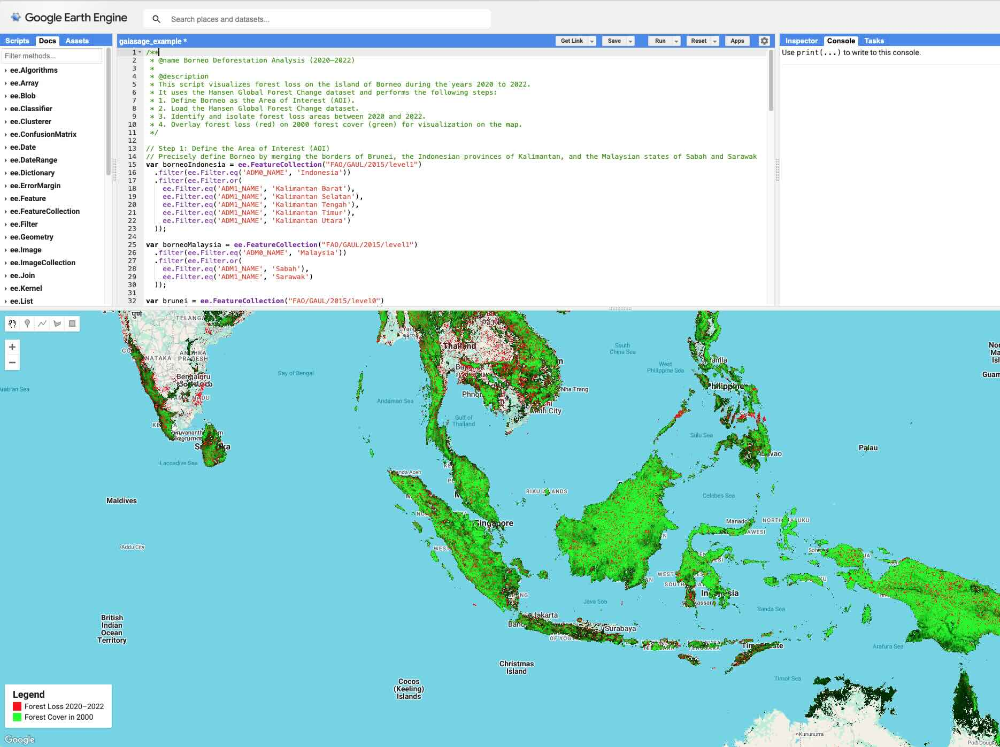

# GaiaSage

**GaiaSage: AI Co-pilot for Geospatial Analysis**

This project is an AI agent designed to assist geospatial analysts, environmental scientists, and other researchers by translating high-level, natural language questions into executable analysis code for platforms like Google Earth Engine.

[中文版](README_CN.md)

## Overview

GaiaSage is built to understand the *intent* behind a user's query, engage in a dialogue to clarify requirements (such as study area and time frame), and then generate the necessary scripts to perform the analysis.


A visual flowchart illustrates the interaction between agents and the data pipeline. The system follows a staged multi-agent orchestration:

```
User Query
   ↓
RootAgent
   ↓
GuardAgent  ──(If Valid)──▶ PlannerAgent ⇄ User
   ↑                                │
   └──────(If Approved)────────────┘
                 ↓
            RootAgent
                 ↓
            CoderAgent
                 ↓
           Final Output
```
.

## Getting Started

1. **Install dependencies:**

    ```bash
    uv sync
    ```

2. **Config .env:**

    ```bash
    cd src
    cp gaiasage/.env.example gaiasage/.env
    # Edit the .env file to set the GOOGLE_API_KEY
    vim gaiasage/.env
    ```

**How to get your Gemini API Key**:

- Navigate to Google AI Studio: https://aistudio.google.com/
- Sign in with your Google account.
- On the left-hand menu, click "Get API key".
- Click "Create API key in new project".
- Your API key will be generated.


3. **Run the agent:**

    ```bash
    cd src
    uv run python -m google.adk.cli web
    ```

## Example chat

Here is a [example chat](chat.md) about conducting deforestation analysis in Borneo and final code running on GEE.



LLM outputs can be unpredictable at times, so your assistance is occasionally needed to clarify requirements—such as specifying datasets or output formats. Click [here]([https://code.earthengine.google.com/aa601898ec0f8ab0284172a590d713f1](https://code.earthengine.google.com/aa601898ec0f8ab0284172a590d713f1)) to see a working google earth engine code. 

## System Architecture & Agent Design

**Target Audience**: Technical reviewers and engineers interested in the internal implementation and design details.

**Primary Goal**: Explain *how the system works*, including the collaboration between agents and the data flow.

---

### 1. High-Level Architecture

**Key Data Artifacts**:

* `User Query`: Initial input from the user.
* `JSON Plan`: Structured analysis plan output by `PlannerAgent`.
* `GEE Code`: Final code generated for execution on Google Earth Engine (GEE).

---

### 2. Agent Team Profiles

Each agent is designed with a clear and distinct responsibility. Below is a profile for each:

---

#### `GuardAgent` (Gatekeeper)

* **Role**: Validates the scope and feasibility of incoming user requests.
* **Model Used**: `gemini-1.5-flash-latest`
* **Design Rationale**: Chosen for its speed and cost-efficiency to handle lightweight classification tasks.
* **Key Instructions**:

  * Operates with strict binary decision rules.
  * Rejects out-of-scope queries immediately.
  * Ensures no expensive computation is triggered unnecessarily.

---

#### `PlannerAgent` (Planner)

* **Role**: Collaborates with the user to create a detailed, structured analysis plan.
* **Model Used**: `gemini-2.5-pro`
* **Design Rationale**: Requires advanced language understanding, reasoning, and planning.
* **Key Instructions**:

  * Follows a four-step workflow: Clarify, Scope, Propose, Confirm.
  * Outputs the plan in a strict JSON format.
  * Awaits user approval before proceeding.

---

#### `CoderAgent` (Coder)

* **Role**: Converts the approved JSON plan into executable code and estimates cost.
* **Model Used**: `gemini-2.5-pro`
* **Design Rationale**: Needs state-of-the-art code generation and resource estimation capabilities.
* **Key Instructions**:

  * Follows a sequential execution: first generate code, then estimate cost.
  * Must not proceed to estimation without producing runnable code.

---

#### `RootAgent` (Coordinator)

* **Role**: Oversees and orchestrates all sub-agents.
* **Design Rationale**: Ensures deterministic workflow and prevents cross-agent chaos.
* **Execution Logic**:

  * Acts as the state machine that drives the process.
  * Handles transition logic and enforces protocol compliance.


## Design Rationale & Key Decisions


### Q\&A Format: Key Design Decisions

#### Q1: Why adopt a multi-agent architecture instead of a monolithic "all-in-one" agent?

**A**: Following the principle of responsibility separation, each agent focuses on a single task. This simplifies prompt design, enhances reliability, and improves maintainability. It also allows modular upgrades—for example, replacing `PlannerAgent` without affecting the rest of the system.

---

#### Q2: Why use different LLM models for different agents?

**A**: To balance cost and performance.

* `GuardAgent` uses the lightweight `Flash` model for quick binary classification at minimal cost.
* `PlannerAgent` and `CoderAgent` use the more powerful `Pro` model for complex reasoning and code generation tasks.

---

#### Q3: Why introduce an explicit “JSON Plan” as an intermediate step?

**A**: The JSON plan serves as a **checkpoint** and **contract**:

* Converts ambiguous natural language into a structured, unambiguous format.
* Ensures full user approval before code generation, reducing costly rework.
* Provides a clean input interface for the `CoderAgent`.

---

#### Q4: What is the strategic value of `GuardAgent`?

**A**: It significantly enhances both user experience and system efficiency:

* Filters out invalid requests early to avoid wasting time and resources.
* Protects more expensive agents from processing irrelevant inputs.
* Acts as a cost-saving firewall.

---

### Future Work & Known Limitations

**Outlook**:

* We plan to leverage data from the `log_out_of_scope_question` tool to enhance predictive rejection and user guidance features.

**Limitations**:

* Currently, the system does not support plan modification after approval.
* Only supports Google Earth Engine (GEE) code generation.
* These limitations reflect deliberate trade-offs to ensure MVP simplicity.
